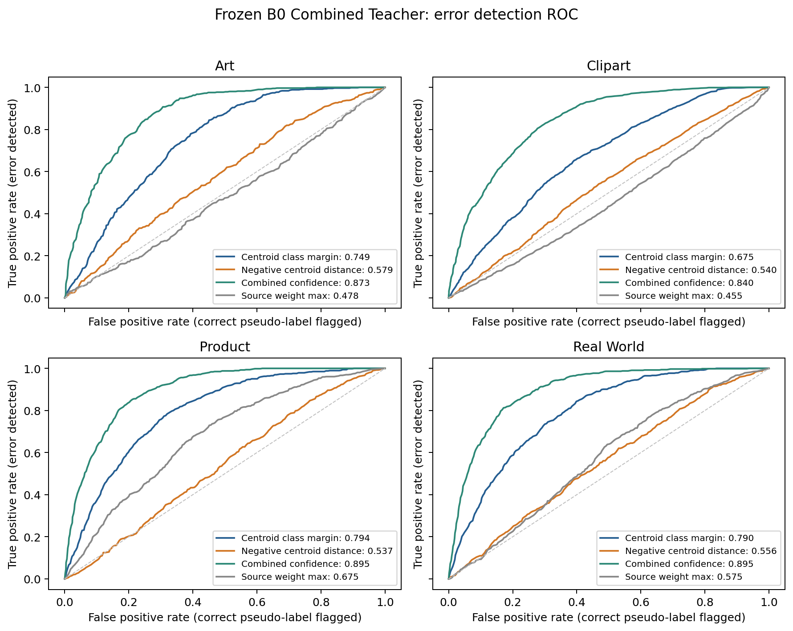
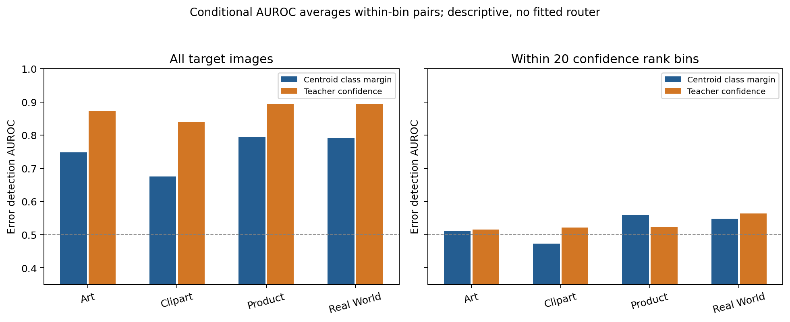
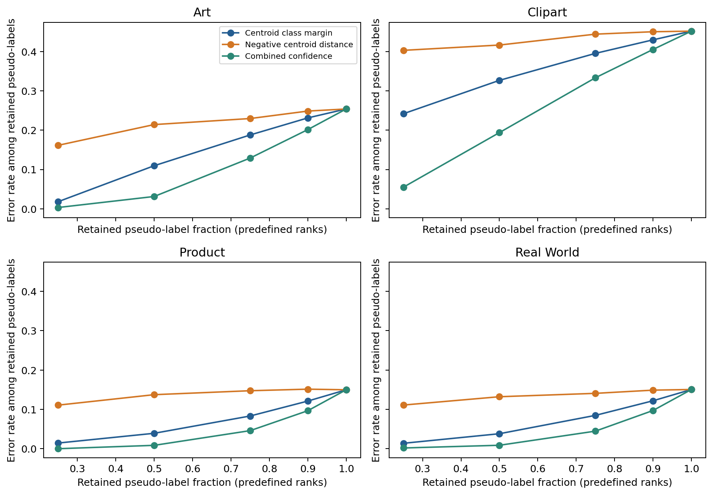
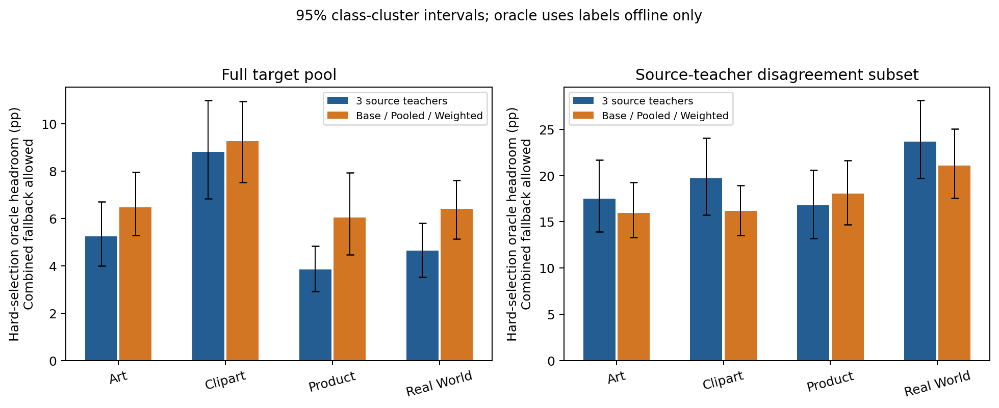

# 冻结 B0：Visual Centroid 类别验证与 Teacher Oracle Headroom

**主要结论：跨类别质心间隔能够区分部分错误伪标签，但其整体 AUROC 低于 Combined Teacher 的置信度，控制置信度后增量信号偏弱。Teacher 选择的 Oracle 空间则明确存在。因此当前更支持把研究重点转向 Teacher Ensemble / Confidence Calibration / Source Knowledge Aggregation，Class Prototype 暂保留为辅助候选。** 没有启动任何训练。

## 数据、状态与标签边界

四个 OfficeHome 3-source→1-target 任务，完整目标池 15,588 张图、65 类。使用已训练 B0 最后一步保存的冻结 prompts、CLIP RN50。目标真实标签只用于诊断指标、类别分层和明确标记的 Oracle；距离、verification score、Teacher 预测、候选选择、置信度分层均不读取目标标签。未拟合可靠性模型，未选择路由参数，未搜索距离或温度。

B0 官方检查点没有保存 running centroids。因此本轮回放原作者的 Python-RNG 源采样序列，基于冻结图像缓存恢复质心：4 个源数据顺序 manifest 哈希匹配原训练，每任务所有 100 个已记录覆盖率检查匹配，每源累计 10,000 次采样，Source Text Features 与之前导出逐元素一致。原始质心没有保存，不能宣称与历史质心逐元素一致；缓存编码 batch=64 与训练 batch=30 也可能有小数值差异。另以完整源数据质心做敏感性对照，主要结果保持一致。

这里的 **Target Teacher** 指给目标样本提供 soft pseudo-label 的 **Combined Teacher**；Target Student 的最后一步及 temporal-average 分类器另存于 summary.json。Combined 是冻结最终状态下按原融合公式重建的教师，不是声称恢复历史 step1000 更新前的每一份伪标签。全池指标也不是作者 shuffle/drop_last 正式测试指标。

## 1. 正确类别的最近源质心是否通常更近

主分析保持原 SPL：未归一化视觉特征的 squared-L2、源维度 softmax、w_scale=10。每张目标图保留完整 [3 sources,65 classes] 距离矩阵；每类取最近源质心，然后比较正确类别与最近错误类别。

| 目标 | 正确类胜过均匀随机错误类 % | 正确类胜过最近错误类 % | 真实类别进入 Top3 % | Combined Accuracy % |
| --- | --- | --- | --- | --- |
| Art | 94.08 | 55.87 | 72.89 | 74.62 |
| Clipart | 84.82 | 30.74 | 49.53 | 54.82 |
| Product | 97.58 | 71.14 | 86.51 | 85.02 |
| Real World | 98.21 | 71.38 | 88.89 | 84.94 |

质心通常能把真实类别排在大多数随机错误类别之前，说明它保留了粗粒度类别证据；但在最近竞争类的比较中，最近质心分类在四域均明显弱于 Combined，尤其 Clipart 只有约 31%。因此不能把 source class mean 当作目标类别正确性的充分证据，也不能直接替换教师伪标签。

## 2. Class Verification 的错误检测能力

预先固定主分数：**最近竞争类别距离−Teacher 预测类别距离**；各类别距离都在源维度取最小值。分数越高，视觉原型越支持 Teacher 的类别。把伪标签正确作为正例计算 AUROC，等价于把分数取负、伪标签错误作为正例检测错误。

| 目标 | 跨类质心间隔 AUROC | 95% 类 cluster CI | Teacher Confidence AUROC | 仅近距离 AUROC | 原 Source Weight Max AUROC | 同置信度层内间隔 AUROC |
| --- | --- | --- | --- | --- | --- | --- |
| Art | 0.7485 | [0.701,0.793] | 0.8730 | 0.5795 | 0.4775 | 0.5122 |
| Clipart | 0.6750 | [0.621,0.729] | 0.8405 | 0.5398 | 0.4545 | 0.4735 |
| Product | 0.7940 | [0.724,0.848] | 0.8949 | 0.5374 | 0.6754 | 0.5587 |
| Real World | 0.7900 | [0.727,0.836] | 0.8947 | 0.5560 | 0.5746 | 0.5481 |

跨类别比较明显强于仅看候选类别距离；但 Combined confidence 在四域都更强。进一步把样本按不看标签的 confidence 排为 20 个等样本量区间，只在各区间内比较正确/错误对，质心间隔的配对加权 AUROC 降到 0.512 / 0.473 / 0.559 / 0.548。**整体 AUROC 0.75 不能直接解释为提供了独立于置信度的强验证信号。** 条件 AUROC 是描述性关联，没有训练/拟合一个 confidence+centroid router，也不能证明两个分数组合毫无潜力。

按真实类别计算的 macro AUROC 与每类支持数见 auroc.csv/per_class.csv；按置信度四分位、≥0.9、≥0.99、源/三路分歧分层见 confidence_disagreement_strata.csv。最高置信度四分位在 Art / Real World 仅各 2 个错误，在 Product 没有错误，因此其中某些漂亮的 AUROC 无法构成可靠证据。

固定、不调阈值的冲突规则：质心主分数<0，即竞争类视觉原型更近。在 Combined confidence≥0.9 的样本中：

| 目标 | 高置信总错误数 | 标出错误 / 误标正确 | 错误检测 precision | 错误 recall | 正确样本误拒率 |
| --- | --- | --- | --- | --- | --- |
| Art | 29 | 8 / 150 | 5.06% | 27.59% | 13.40% |
| Clipart | 55 | 14 / 234 | 5.65% | 25.45% | 23.21% |
| Product | 65 | 10 / 285 | 3.39% | 15.38% | 10.47% |
| Real World | 66 | 11 / 276 | 3.83% | 16.67% | 10.33% |

原型冲突能提高部分错误的浓度，但误拒大量正确伪标签。例如 Art 找到 8 个高置信错误，同时标出 150 个正确预测；Clipart 为 14 vs 234。不能将这一规则直接作为硬否决或标签纠正器。固定 coverage 排名对照也显示 confidence 更有效地保留高质量伪标签。

## 3. Teacher 分歧时，改良的 Oracle 空间

Oracle 只使用目标真标签离线计算。分别考察 3 个 Source Teachers，以及 Base/Pooled/Weighted 3 路教师。允许保留 Combined 的 Oracle 可避免把 Combined 正确、所有候选错误的样本强行替换；candidate-only oracle 另存于 summary.json。

| 目标 | Combined % | Source+Combined Oracle % | 全池 Source Headroom pp | 可修复 Combined 错误数 | 源分歧样本数 | 分歧子集 Source Headroom pp | 全池三路 Branch Headroom pp |
| --- | --- | --- | --- | --- | --- | --- | --- |
| Art | 74.62 | 79.85 | +5.23 | 127 | 709 | +17.49 | +6.47 |
| Clipart | 54.82 | 63.64 | +8.82 | 385 | 1887 | +19.71 | +9.26 |
| Product | 85.02 | 88.87 | +3.85 | 171 | 942 | +16.77 | +6.04 |
| Real World | 84.94 | 89.58 | +4.64 | 202 | 812 | +23.65 | +6.40 |

四域等权平均 Source+Combined Oracle Headroom 为 **5.64pp**；分歧子集约 16.77–23.65pp。空间不小，但它是假设能够识别错误并挑中正确意见的理想值，不能当作可达到的性能预测。该上界只针对指定候选的 hard top1 selection，不是新训练模型、软分布融合或创造新类别预测的上界。NLL 的 source+combined Oracle 也保留了 0.126–0.309 的改善空间。

但用当前质心证据在 Source Teachers 给出的候选类别之间直接选最近者，结果如下：

| 目标 | 全池较 Combined Δpp | 源分歧子集 Δpp | 分歧中救回错误 | 分歧中破坏正确 |
| --- | --- | --- | --- | --- |
| Art | -3.38 | -10.86 | 50 | 127 |
| Clipart | -3.02 | -6.47 | 147 | 269 |
| Product | -3.04 | -13.27 | 73 | 198 |
| Real World | -1.26 | -6.16 | 89 | 139 |

可供选择的正确意见确实存在，但当前质心规则没有找到它们的可靠选择方式。分歧区域的 centroid margin AUROC 仅约 0.558–0.638，低于 confidence 的 0.707–0.755。

## 4. 原 Source Weighting 已经包含哪些信息

原权重是**类条件的相对源亲和度**，并非完全不含类别信息。但在同一候选类别下，对全部源距离加同一个数，源维度 softmax 不变；跨类别加不同公共偏移时，它也不保存这些公共偏移。数值反事实验证：给每类全部源距离加相同的预定类别偏移，source weights 的 max error<1e-9，而最近原型类别发生变化。改变的是距离矩阵的代数反事实，没有生成图像或声称这是现实中的物理变换。

因此矩阵确实还包含原源路由没有显式保留的跨类别/公共距离信息；问题在于**这些额外信息在当前 CLIP+单质心表示下是否足够可靠**。本轮 global margin AUROC 有效，但置信度条件后的信号偏弱。Teacher text logits 本身仍包含类别判断，不能把 Source Weighting 的信息损失说成整个 SPL 完全不能判断类别。

## 5. 静态融合对照与研究定调

所有对照都只在同一批冻结 B0 文本特征上计算，没有重新训练、学习权重或依据目标标签选择规则。

| 目标 | 原 Combined % | 均匀 Source Logits % | Base+Pooled % | Base+Pooled+UniformSource % | Source/Combined 中选最高置信 % |
| --- | --- | --- | --- | --- | --- |
| Art | 74.62 | 72.39 | 75.24 | 74.82 | 72.56 |
| Clipart | 54.82 | 53.59 | 55.46 | 55.44 | 54.30 |
| Product | 85.02 | 82.77 | 85.02 | 84.95 | 82.54 |
| Real World | 84.94 | 83.77 | 85.43 | 85.13 | 84.07 |

Weighted Source 单路分别为 70.33 / 51.20 / 82.02 / 80.86%，均低于相同 Source Teachers 的均匀 logit 平均。固定 Base+Pooled 在 Art、Clipart、Real World 上也略高于三路 Combined，Product 相同。**这些是最终固定状态的对照，不能推断训练时删除 Weighted 分支就会得到相同增益**；但值得具体检查它在哪些类别/样本上救回或破坏已有知识。

另一方面，直接选择最高 confidence 的 Source/Combined 在四域都低于 Combined。这说明“Combined confidence 能检测图像难度”与“不同 Teacher 的 confidence 能公平比较其可靠性”是不同问题，后者可能需要校准和类别能力控制。

建议当前主线收敛到：Source Teachers 保留有价值的互补意见，但原类条件源路由与固定三路融合没有可靠地利用这些意见。优先进一步静态研究 source/branch confidence 的可比较性、冲突类别、错误相关性与 Pooled-source 的知识融合；Class Prototype 暂作为辅助诊断，不据本轮直接进入硬 verification 或新的训练机制。MINT 的伪标签/蒸馏经验可复用在这一步，但不能代替当前任务中的可靠性证据。

## 敏感性、限制与输出

| 目标 | 完整源质心 Combined Δpp | 完整源质心 Margin AUROC Δ |
| --- | --- | --- |
| Art | -0.041 | +0.0005 |
| Clipart | -0.023 | +0.0000 |
| Product | +0.000 | +0.0038 |
| Real World | -0.069 | -0.0006 |

- 单一已训练种子。类 cluster bootstrap 只刻画冻结模型下的类/数据构成不确定性，不代表训练种子显著性。
- 主要 score 提前固定为 class margin；其他分数为机制对照，没有据 AUROC 挑选部署分数或参数。
- 原质心未保存，采样回放不是有原张量对照的逐元素复原；完整源质心敏感性提供了交叉检查。
- Student 的正式论文性能不能由静态 Teacher Oracle 推导；本轮没有训练或做在线标签纠正。
- auroc.csv：所有教师及分数的 micro/按真实类别/按预测类别 macro AUROC。
- per_class.csv：65 类的验证和最近质心分类指标。
- confidence_disagreement_strata.csv：固定置信度和分歧分层。
- supplement.json：条件 AUROC、固定冲突规则误检/漏检、静态融合对照。
- summary.json / preparation.json / provenance.json：主要指标、采样回放依据、代码与输入状态 SHA、零更新记录。
- 服务器 `~/workspace/Style-SPL/runs/b0_centroid_20261010/analysis/per_image_*.pt` 保存逐图像 [source,class] 距离矩阵、原源权重、教师预测、verification scores 和离线标签；prepared/b0_static_state.pt 保存回放/完整源质心及冻结教师特征。大张量不进入 git。
