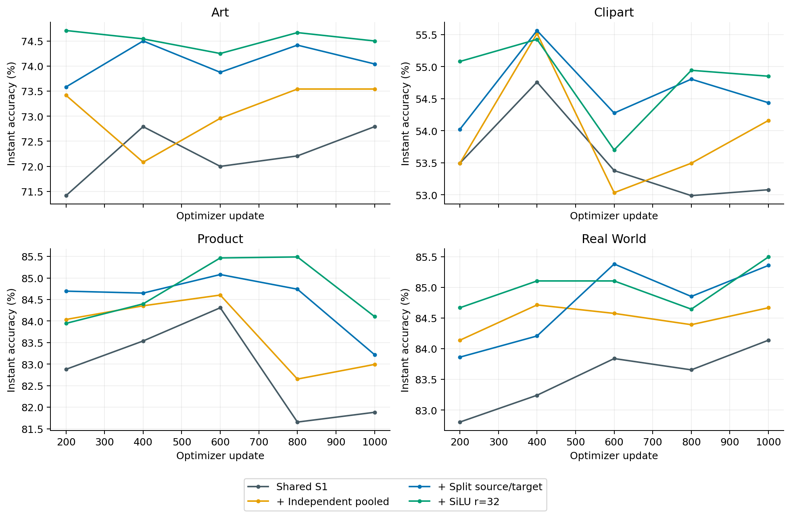
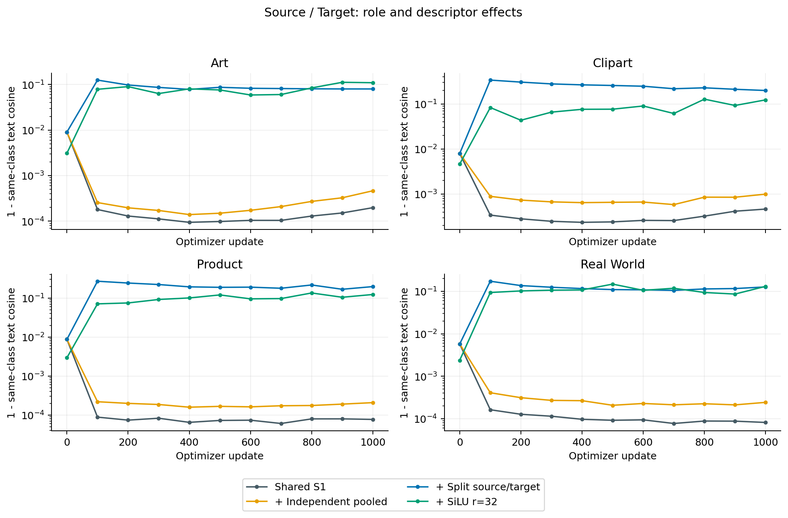
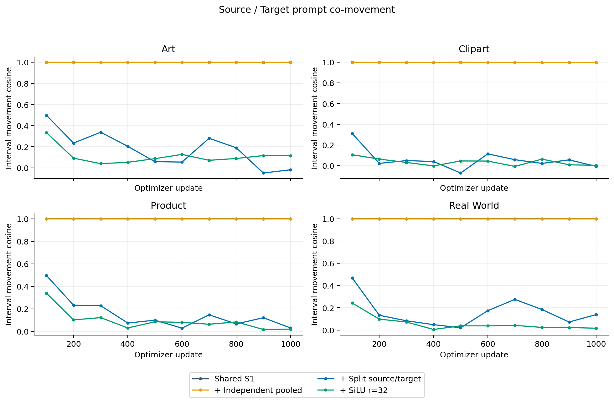
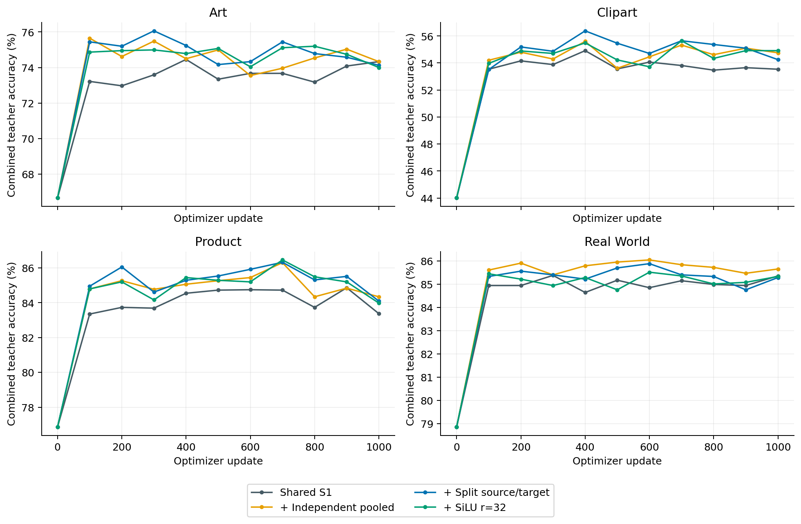
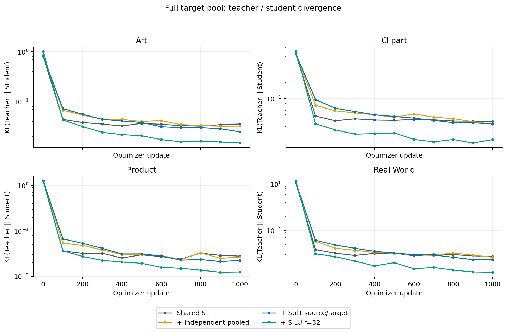
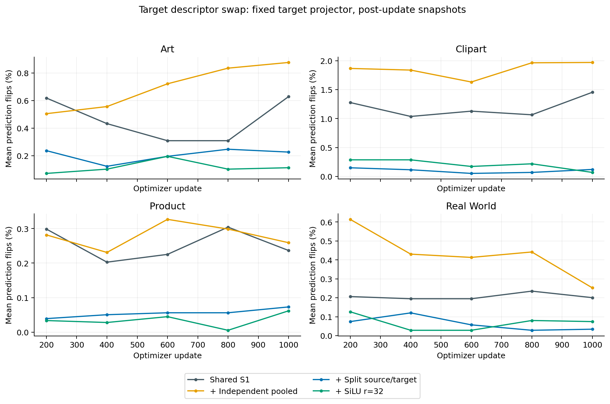
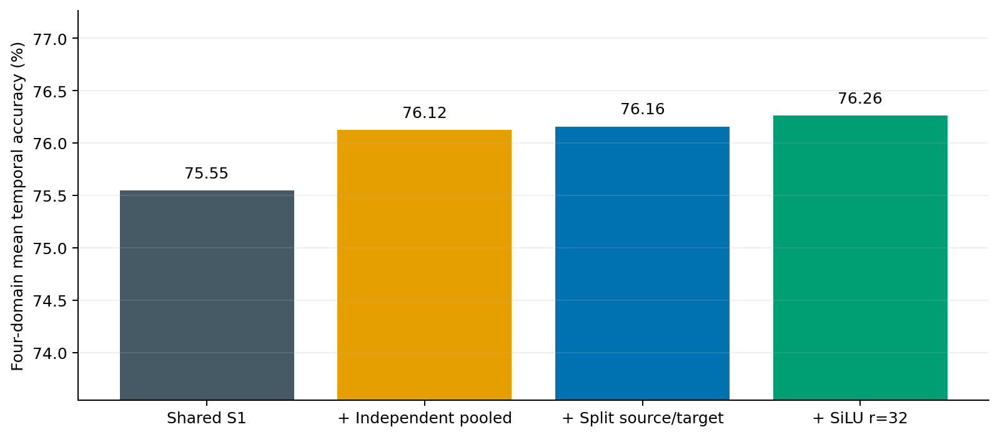

# Style-SPL 受控结构消融

先解除 Pooled 的严格线性约束，再解除 Source/Target Projector 参数耦合，最后更换 Stage 映射。所有正式实验保持同一固定 Bank、种子 1、Office-Home 四个 3→1 任务、1000 次更新、原 SPL 损失及采样、学习率 .005 与原调度器。没有同时调整学习率、Extractor Stage 或 Bank。

独立 Pooled Tokens 的初值严格复制 S1 初始 Linear Projector 的 Pooled 输出；r2/r3/r4 的 Pooled 初值一致。线性三组在真实 CLIP、同一批数据上的初始 Loss 完全一致。Source/Target 分离会同时分离其 Stage 参数和 Expansion 参数，二者从相同校准状态复制；共享 Class Prompt 保持原 SPL 设计。

SiLU r=32 的两层 Linear 使用 PyTorch 默认初始化；仅将第二层 Weight/Bias 按固定 Bank 的初始全局 Prompt RMS 一次性缩放到 .02。保持 one-hot Expansion 初始化，后续允许正常学习；没有训练期 RMS 截断或重校准。

随机初始化独立 Pooled Tokens 的早期先导实验已单独归档为 r2_pooled_random_init_pilot，因混入初始化差异而排除正式对比。

## 复现和观测有效性

S1 重放逐位核对 Prompt、Optimizer、Scheduler、RNG、源/目标数据流、Centroids、Loss Valley、缓存累计次数及 Instant 最佳值；四域全部一致。

原运行只保留最终完整 checkpoint 和部分 Expansion，因此历史轨迹来自经过验证的重放。每 100 步保存五组 Prompt、同类别 Text Features、Bank/模型状态、Teacher KL 和损失分支梯度；每 200 步做描述符替换。梯度取自实际训练图的更新前状态，文本与 Prompt 快照为更新后状态；不能把两者视为完全同一状态。原 checkpoint 上的额外梯度来自最终状态的下一批数据，不冒称原 step1000 的历史梯度。

## 正式性能

正式性能使用原 SPL 的时间平均 Target Text Features，以及 shuffle=True/drop_last=True 评测。其余 Teacher 和替换诊断使用全部固定缓存 Target 图像，没有丢弃尾批。两种分母不同，应分别比较。

| 模型 | Art | Clipart | Product | Real World | Mean % | 相对上一组 pp |
| --- | --- | --- | --- | --- | --- | --- |
| 修正数据协议的 SPL B0 | 76.38 | 56.41 | 86.51 | 86.21 | 76.38 | — |
| S1 Shared | 75.21 | 56.07 | 85.17 | 85.75 | 75.55 | — |
| + 独立 Pooled Tokens | 75.75 | 56.44 | 85.99 | 86.32 | 76.12 | +0.58 |
| + Source/Target 分离 | 76.42 | 55.86 | 86.03 | 86.32 | 76.16 | +0.03 |
| + SiLU r=32 | 75.83 | 56.48 | 86.55 | 86.18 | 76.26 | +0.11 |

## 同模型内域条件差异与共同移动

下表比较每个模型内同一类别的 Source/Target 文本，不比较独立训练模型之间的差异。平均范围为三个源域配对目标域。Prompt 移动量余弦比较相邻 100 步的差值；高共同移动和高文本余弦是观测关联，单凭这一关联不能确定唯一因果。

r3/r4 的 Source–Target 对比同时包含不同 Projector 参数这一因素，较低余弦只能直接说明角色表示不同，不能直接证明 Style Descriptor 更有效。Source–Source 使用同一 Source Projector，固定角色参数的描述符替换也能隔离输入条件的实际作用；解释 Style Conditioning 时应优先使用这两项证据。

| 模型 | 目标 | 步数 | 初始 S–T Text Cos | 当前 S–T Text Cos | S–S Text Cos | P–T Text Cos | 区间 S–T Prompt 移动 Cos |
| --- | --- | --- | --- | --- | --- | --- | --- |
| S1 Shared | art | 1000 | 0.990963 | 0.999802 | 0.999856 | 0.999853 | 0.998822 |
| S1 Shared | clipart | 1000 | 0.992043 | 0.999535 | 0.999778 | 0.999646 | 0.995444 |
| S1 Shared | product | 1000 | 0.991262 | 0.999923 | 0.999917 | 0.999960 | 0.999276 |
| S1 Shared | real_world | 1000 | 0.994242 | 0.999918 | 0.999861 | 0.999952 | 0.999029 |
| + 独立 Pooled Tokens | art | 1000 | 0.990963 | 0.999535 | 0.999677 | 0.914842 | 0.998108 |
| + 独立 Pooled Tokens | clipart | 1000 | 0.992043 | 0.999003 | 0.999326 | 0.854341 | 0.996371 |
| + 独立 Pooled Tokens | product | 1000 | 0.991262 | 0.999792 | 0.999645 | 0.877522 | 0.999207 |
| + 独立 Pooled Tokens | real_world | 1000 | 0.994242 | 0.999757 | 0.999613 | 0.828948 | 0.998715 |
| + Source/Target 分离 | art | 1000 | 0.990963 | 0.920041 | 0.999760 | 0.879893 | -0.017890 |
| + Source/Target 分离 | clipart | 1000 | 0.992043 | 0.800958 | 0.999505 | 0.825875 | -0.006971 |
| + Source/Target 分离 | product | 1000 | 0.991262 | 0.803013 | 0.999628 | 0.805127 | 0.029915 |
| + Source/Target 分离 | real_world | 1000 | 0.994242 | 0.873230 | 0.999416 | 0.770999 | 0.138805 |
| + SiLU r=32 | art | 1000 | 0.996890 | 0.890342 | 0.999664 | 0.898008 | 0.115761 |
| + SiLU r=32 | clipart | 1000 | 0.995363 | 0.876849 | 0.999905 | 0.878266 | 0.003581 |
| + SiLU r=32 | product | 1000 | 0.997052 | 0.876428 | 0.999242 | 0.859242 | 0.018574 |
| + SiLU r=32 | real_world | 1000 | 0.997621 | 0.869260 | 0.999949 | 0.824243 | 0.016256 |

## Projector 梯度耦合

Source Objective 为 Pooled CE + 平均 Source CE；Target Objective 为 .5×Target Soft CE。Teacher 概率已 detach。梯度方向使用对应参数上的完整 FP32 向量，余弦无需平滑或 PCA。分离组要求 Source Projector 的 Target 梯度、Target Projector 的 Source 梯度严格为零；实际探测器一旦违反该条件便停止训练。共享 Class Prompt 的交叉作用仍存在，不能称为整个 Teacher/Student 完全解耦。

| 模型 | 目标 | 探测步数 | Source 参数上 Source 梯度范数 | Source 参数上 Target 梯度范数 | 共享参数方向 Cos | Target 参数上 Source 梯度范数 |
| --- | --- | --- | --- | --- | --- | --- |
| S1 Shared | art | 1000 | 0.24889 | 0.034616 | 0.26864 | 共用 |
| S1 Shared | clipart | 1000 | 0.32145 | 0.031188 | -0.04412 | 共用 |
| S1 Shared | product | 1000 | 0.37401 | 0.031706 | 0.08164 | 共用 |
| S1 Shared | real_world | 1000 | 0.68792 | 0.024069 | 0.15717 | 共用 |
| + 独立 Pooled Tokens | art | 1000 | 0.18395 | 0.046295 | 0.67176 | 共用 |
| + 独立 Pooled Tokens | clipart | 1000 | 0.14975 | 0.015867 | -0.11973 | 共用 |
| + 独立 Pooled Tokens | product | 1000 | 0.18027 | 0.026188 | -0.13965 | 共用 |
| + 独立 Pooled Tokens | real_world | 1000 | 0.34225 | 0.018867 | -0.28820 | 共用 |
| + Source/Target 分离 | art | 1000 | 0.15148 | 0 | 无交叉梯度 | 0 |
| + Source/Target 分离 | clipart | 1000 | 0.14997 | 0 | 无交叉梯度 | 0 |
| + Source/Target 分离 | product | 1000 | 0.24491 | 0 | 无交叉梯度 | 0 |
| + Source/Target 分离 | real_world | 1000 | 0.21625 | 0 | 无交叉梯度 | 0 |
| + SiLU r=32 | art | 1000 | 0.32484 | 0 | 无交叉梯度 | 0 |
| + SiLU r=32 | clipart | 1000 | 0.30884 | 0 | 无交叉梯度 | 0 |
| + SiLU r=32 | product | 1000 | 0.29561 | 0 | 无交叉梯度 | 0 |
| + SiLU r=32 | real_world | 1000 | 0.47927 | 0 | 无交叉梯度 | 0 |

## Teacher Quality 和蒸馏差异

Base 为冻结模板 CLIP，Pooled 为混合源 Prompt，Weighted Source 按图像及类别执行原 SPL 的负平方距离 Softmax 路由，Combined 平均三路 Logits。KL 的方向为 KL(Teacher || Student)，在全部目标样本上计算。

| 模型 | 目标 | 步数 | Base % | Pooled % | Weighted % | Combined % | Live Student % | KL(T||S) |
| --- | --- | --- | --- | --- | --- | --- | --- | --- |
| S1 Shared | art | 1000 | 71.57 | 72.39 | 72.19 | 74.33 | 72.68 | 0.03606 |
| S1 Shared | clipart | 1000 | 50.31 | 52.71 | 52.71 | 53.54 | 52.90 | 0.03752 |
| S1 Shared | product | 1000 | 81.84 | 81.89 | 81.87 | 83.37 | 81.91 | 0.02777 |
| S1 Shared | real_world | 1000 | 82.53 | 84.00 | 84.03 | 85.36 | 84.07 | 0.02733 |
| + 独立 Pooled Tokens | art | 1000 | 71.57 | 72.60 | 73.47 | 74.33 | 73.59 | 0.03278 |
| + 独立 Pooled Tokens | clipart | 1000 | 50.31 | 52.97 | 53.84 | 54.75 | 54.02 | 0.03347 |
| + 独立 Pooled Tokens | product | 1000 | 81.84 | 81.59 | 82.99 | 84.34 | 83.04 | 0.02646 |
| + 独立 Pooled Tokens | real_world | 1000 | 82.53 | 83.89 | 84.60 | 85.66 | 84.65 | 0.02646 |
| + Source/Target 分离 | art | 1000 | 71.57 | 72.39 | 71.53 | 74.12 | 73.84 | 0.02507 |
| + Source/Target 分离 | clipart | 1000 | 50.31 | 51.71 | 52.65 | 54.25 | 54.34 | 0.03373 |
| + Source/Target 分离 | product | 1000 | 81.84 | 81.66 | 81.21 | 84.10 | 83.31 | 0.02238 |
| + Source/Target 分离 | real_world | 1000 | 82.53 | 83.13 | 83.36 | 85.29 | 85.40 | 0.02359 |
| + SiLU r=32 | art | 1000 | 71.57 | 71.45 | 71.03 | 74.00 | 74.37 | 0.01506 |
| + SiLU r=32 | clipart | 1000 | 50.31 | 53.38 | 52.55 | 54.91 | 54.75 | 0.01723 |
| + SiLU r=32 | product | 1000 | 81.84 | 81.05 | 80.87 | 83.98 | 84.03 | 0.01248 |
| + SiLU r=32 | real_world | 1000 | 82.53 | 83.11 | 82.90 | 85.33 | 85.56 | 0.01256 |

## 描述符反事实替换

保持模型参数、Class Prompt、图像特征不变，仅将某角色的 Bank 输入改为其他域或 Pooled Descriptor，仍使用该角色自己的 Projector。汇报同类别 Text Cosine、原始及逐图像去均值后的 scaled-logit RMS 差、预测翻转率和分布 KL。去均值可以排除不会改变分类的公共 Logit 偏移。独立 Pooled Tokens 不读取 Descriptor，因此对该角色的描述符替换应严格无影响，这是预期行为。全部配对与每个时点位于 descriptor_swaps.csv。

## 解释与下一步边界

r2−r1 检验独立 Pooled 模块的整体价值。它不仅释放 Pooled 等于源 Prompt 线性平均的约束，也切断 Pooled 对共享 Projector 的依赖，并将其从 Expansion×四个 Stage Tokens 的秩约束中释放；因此不能把收益唯一归因于线性平均恒等式。r3−r2 检验剩余 Source/Target 生成器耦合的影响；r4−r3 检验 r=32 非线性 Stage 映射的组合效果。最后一项同时改变了映射非线性、容量及优化参数化；若有收益，还需未来独立控制容量后才能声称收益来自 SiLU。

这轮只有一个种子，不声称统计显著，也不使用目标标签选 checkpoint。域间 Text Feature 差异更大只是分支多样性证据；是否有用还要同时看 Teacher Quality、Student Accuracy、替换敏感性，不能只凭余弦数值给方法判优。Stage4-only、r=64、学习率调整未混入本轮。

## 多路 Teacher 是否退化成相近分布

以下额外诊断只在 CPU 上重算保存状态，没有关闭 Base 重新训练。Without Base = Pooled 与 Weighted Source 的 Logits 平均。比较该分布与 Student 的 KL，以及 Soft CE 对 scaled Student Logits 的梯度 q_student−p_teacher。它说明分类分布层面的指导强弱，不是网络参数梯度的因果归因。

| 模型 | 目标 | KL(Without Base || Student) | KL(Combined || Student) | Without Base/Combined 梯度范数 | Combined/Base 梯度方向 Cos |
| --- | --- | --- | --- | --- | --- |
| S1 Shared | art | 0.000228 | 0.036055 | 0.081 | 0.825 |
| S1 Shared | clipart | 0.000615 | 0.037524 | 0.135 | 0.876 |
| S1 Shared | product | 0.000036 | 0.027774 | 0.038 | 0.810 |
| S1 Shared | real_world | 0.000035 | 0.027329 | 0.036 | 0.799 |
| + 独立 Pooled Tokens | art | 0.015745 | 0.032782 | 0.735 | 0.695 |
| + 独立 Pooled Tokens | clipart | 0.027389 | 0.033469 | 0.969 | 0.683 |
| + 独立 Pooled Tokens | product | 0.010212 | 0.026460 | 0.634 | 0.698 |
| + 独立 Pooled Tokens | real_world | 0.010910 | 0.026461 | 0.688 | 0.691 |
| + Source/Target 分离 | art | 0.046817 | 0.025071 | 1.486 | 0.360 |
| + Source/Target 分离 | clipart | 0.080973 | 0.033725 | 1.728 | 0.303 |
| + Source/Target 分离 | product | 0.046547 | 0.022381 | 1.564 | 0.303 |
| + Source/Target 分离 | real_world | 0.047234 | 0.023588 | 1.504 | 0.318 |
| + SiLU r=32 | art | 0.049278 | 0.015058 | 1.984 | 0.305 |
| + SiLU r=32 | clipart | 0.066036 | 0.017233 | 2.235 | 0.231 |
| + SiLU r=32 | product | 0.033390 | 0.012483 | 1.821 | 0.372 |
| + SiLU r=32 | real_world | 0.034048 | 0.012557 | 1.763 | 0.342 |

所有正式组的初始 Class Prompt、固定 Bank、实际源域 Centroids/Count、RNG、Source/Target 数据流和 Scheduler 均逐位一致；采样和固定图像特征差异未混入架构比较。

## Target 梯度是否实际推动 Source Prompt

在初始状态，将真实第一批 Target Objective 梯度作为方向，计算 Prompt 生成函数的 Jacobian 响应。没有运行优化器、没有有限幅度参数替换，Class Prompt 保持不变。它检验的是 Projector 这条直接耦合路径；其数值不是实际 AdamW 更新的 RMS。

| 模型 | 目标 | Source/Target 响应范数比 | Source Prompt 严格零响应 |
| --- | --- | --- | --- |
| S1 Shared | art | 0.982721 | 否 |
| S1 Shared | clipart | 0.959729 | 否 |
| S1 Shared | product | 0.942898 | 否 |
| S1 Shared | real_world | 0.987201 | 否 |
| + 独立 Pooled Tokens | art | 0.982721 | 否 |
| + 独立 Pooled Tokens | clipart | 0.959729 | 否 |
| + 独立 Pooled Tokens | product | 0.942898 | 否 |
| + 独立 Pooled Tokens | real_world | 0.987201 | 否 |
| + Source/Target 分离 | art | 0.000000 | 是 |
| + Source/Target 分离 | clipart | 0.000000 | 是 |
| + Source/Target 分离 | product | 0.000000 | 是 |
| + Source/Target 分离 | real_world | 0.000000 | 是 |
| + SiLU r=32 | art | 0.000000 | 是 |
| + SiLU r=32 | clipart | 0.000000 | 是 |
| + SiLU r=32 | product | 0.000000 | 是 |
| + SiLU r=32 | real_world | 0.000000 | 是 |

所有正式实验已完成。

逐步平均准确率变化：独立 Pooled +0.575 pp；分离生成器 +0.034 pp；SiLU r=32 +0.105 pp。

## 本轮实际结论

独立 Pooled 使四个目标域全部改善，是当前最一致的结构收益。Source/Target 分离直接消除了 Target 对 Source 生成参数的梯度路径，并显著降低角色之间的 Text Cosine，但均值只增加约 .034 pp；它证实功能性耦合，不足以证明耦合是性能损失的主要原因。

SiLU r=32 相比分离 Linear 平均增加约 .105 pp，Art 和 Real World 下降、Clipart 和 Product 上升，不能称为稳定增益。当前最好的 76.263% 仍略低于 SPL B0 的 76.376%。SiLU 版可训练参数 1,167,744，相比分离 Full Linear 的 8,409,216 减少约 86.1%；这只能支持相对该 Linear 版本的效率优势。

MLP 内三个 Source 的同类别 Text Cosine 仍在 .99924–.99995；固定 Target Projector 的描述符替换平均仅翻转约 .06–.11% 的预测。Source–Target 的表示差异主要不能归功于 Style Descriptor，因为两侧 Projector 权重已经不同。现有证据尚未证明真实 Style Bank 比常量条件或普通可学习 Tokens 更必要。

Style 方法有继续做机制验证的价值，但现在不宜把它写成已经成立的域条件适配方法。更有判别力的后续控制是验证 Bank 的必要性，并单独考察输入的公共分量与域残差；应先于扩大 r 或混入 Stage4-only/学习率改动。本轮没有启动这些额外训练。
