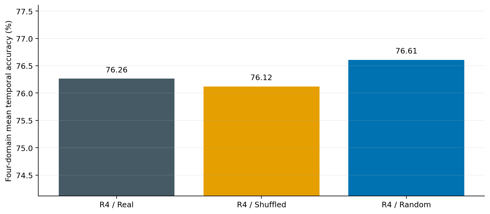
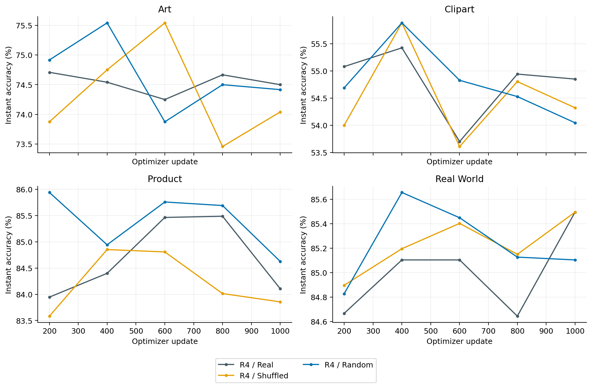
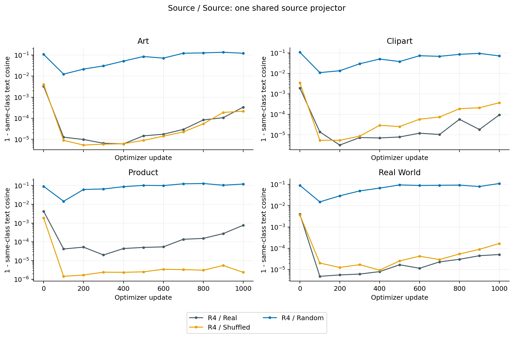
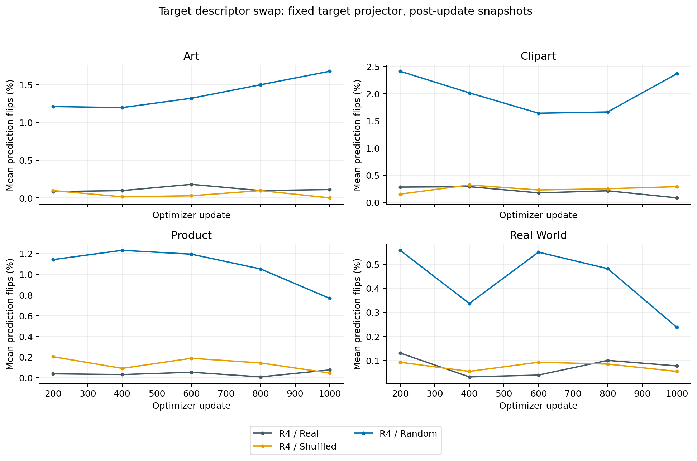
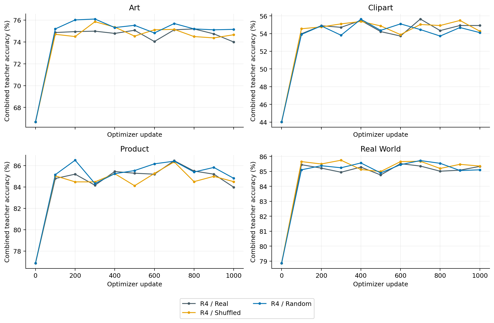

# R4：真实 Style Descriptor 的必要性验证

固定 R4 的网络结构、损失、路由、优化器、学习率、调度、采样和评测，只替换固定 Descriptor。Office-Home 四个 3→1 任务，seed=1，每任务 1000 次更新；共新增八次完整训练。Real 引用已完成的原 R4，不重复训练或挑选 checkpoint。

## 控制条件

Shuffled 在 Art、Clipart、Product、Real World 四个真实域之间固定置换，四个 Stage 的均值和标准差整组移动；无固定点，各任务采用同一实际域名映射。

固定映射：art → real_world；clipart → art；product → clipart；real_world → product。

Random 使用独立 CPU RNG（20261010）生成固定随机域代码。每个 Stage 的 mean/std 输入块分别匹配真实四域所有通道的全局均值和总体标准差；各域代码共享相同标量尺度，但通道排列、各域真实统计值与域间几何关系不保留。随机数不消耗训练 RNG；所有时点输入保持不变。这些输入是随机代码，不再解释为物理图像统计。

独立 Pooled Tokens 始终复制原真实 Linear Bank 的校准输出，三组初值逐位相同；Pooled 不读取控制后的 Descriptor。未使用的 Pooled Bank 行保留真实参考值，随机输入和输出尺度校准均已记录。

R4 两层 Linear 原始初始化相同，Expansion 保留 one-hot 初始化。Shuffled 保持原 R4 的校准参数逐位一致；Random 沿用 R4 策略，仅按实际固定输入输出的初始全局 RMS=.02 缩放第二层 Weight/Bias，因此其第二层校准系数与 Real 可以不同。没有训练期 RMS 限制。这是相同架构/初始化规则的输入控制，不是三组初始 Text Features 完全相同。

17 项单元测试与真实两步训练验收通过；原 Real 的初始模型逐位匹配旧 R4。完整训练后再次核对类别/Pooled 初值、原 Bank SHA、数据流、训练 RNG、源域 Centroids/Counts 和 Scheduler，全四域均一致；有效 Descriptor 全程冻结，生成器交叉梯度严格为零。

## 正式性能

以下为原 SPL 的时间平均 Target Text Features，评测保留 shuffle=True/drop_last=True。

| 条件 | Art | Clipart | Product | Real World | Mean % | 相对 Real pp |
| --- | ---: | ---: | ---: | ---: | ---: | ---: |
| R4 / Real | 75.83 | 56.48 | 86.55 | 86.18 | 76.26 | +0.000 |
| R4 / Shuffled | 75.88 | 56.09 | 86.01 | 86.51 | 76.12 | -0.143 |
| R4 / Random | 76.71 | 55.98 | 87.01 | 86.74 | 76.61 | +0.344 |

已修正数据协议的 SPL B0 四域均值为 76.376%。本轮不以追平 B0 作为 Style 有效性的证据。

## 同一完整目标池上的配对预测

各模型使用最终保存的时间平均文本，在同一完整缓存目标图像上重新分类；不丢弃尾批。因此它与正式性能的分母略有不同。

| 目标 | Real % | Shuffled % | Random % | Real−Shuffled pp | Real−Random pp |
| --- | ---: | ---: | ---: | ---: | ---: |
| art | 75.690 | 75.731 | 76.514 | -0.041 | -0.824 |
| clipart | 56.518 | 56.082 | 56.014 | 0.435 | 0.504 |
| product | 86.574 | 86.055 | 87.047 | 0.518 | -0.473 |
| real_world | 86.183 | 86.504 | 86.734 | -0.321 | -0.551 |

配对图像 Bootstrap 只反映固定已训练模型下的样本波动，不覆盖训练种子或随机代码/置换种子的波动，不能据此声称跨种子显著。

- Real−R4 / Shuffled：完整池四域平均 +0.148 pp；条件图像区间 [-0.160, +0.458] pp。
- Real−R4 / Random：完整池四域平均 -0.336 pp；条件图像区间 [-0.653, -0.031] pp。

## Teacher 与输入条件响应

Teacher 使用最后一次更新后的当前 Prompt、完整缓存目标图像，不能与时间平均 Student 的正式精度直接混为同一指标。Descriptor 替换保持角色及模型参数不变，仅在四个实际域的输入之间互换；以下 Target 翻转率排除了未使用的 Pooled Descriptor。

| 条件 | Combined Teacher Mean % | Weighted Source Mean % | Source–Source Text Cos 范围 | Target 输入替换翻转率范围 % |
| --- | ---: | ---: | --- | --- |
| R4 / Real | 74.558 | 71.841 | 0.999242–0.999949 | 0.075–0.110 |
| R4 / Shuffled | 74.698 | 72.361 | 0.999630–0.999998 | 0.000–0.290 |
| R4 / Random | 74.797 | 72.812 | 0.879909–0.928424 | 0.237–2.367 |

## 输入几何与表示差异

随机对照匹配输入尺度，但有意不匹配真实域间几何关系。下表给出四个任务中，三个 Source 的 Descriptor 两两 Cosine 的平均值；每个 Stage 拼接 mean/std 后计算。它只是输入几何，不是分类价值或唯一根因的证明。

| 输入 | Stage1 | Stage2 | Stage3 | Stage4 |
| --- | ---: | ---: | ---: | ---: |
| real | 0.998040 | 0.996877 | 0.999167 | 0.927439 |
| shuffled | 0.998040 | 0.996877 | 0.999167 | 0.927439 |
| random | 0.484559 | 0.447931 | 0.279011 | 0.476738 |

下表进一步对比 Source Prompt 与同类别 Text 的差异，均为四任务平均。较小的余弦不自动意味着更好分类；Random 若能保留差异，说明当前网络不一定会消除所有条件差异，不能把真实输入的趋同直接归因于分类目标这一单一因素。

| 条件 | 初始 Source Prompt Cos | 最终 Source Prompt Cos | 初始 Source Text Cos | 最终 Source Text Cos |
| --- | ---: | ---: | ---: | ---: |
| R4 / Real | 0.995774 | 0.998182 | 0.996636 | 0.999690 |
| R4 / Shuffled | 0.995774 | 0.998960 | 0.996743 | 0.999811 |
| R4 / Random | 0.564651 | 0.784480 | 0.901461 | 0.894829 |

## 现有 Source Teacher 的路由空间

此项只读检查没有提取逐图像 Style，也没有拟合或训练新路由。它测量最后状态三个 Source Teacher 的预测分歧，为下一步可靠性诊断提供背景。

| 目标 | 三者预测一致率 % | 最佳单一 Source % | 任一 Source 正确的理想选择 % | 理想选择−最佳单一 pp |
| --- | ---: | ---: | ---: | ---: | ---: |
| art | 98.063 | 71.034 | 71.652 | 0.618 |
| clipart | 99.290 | 52.531 | 52.600 | 0.069 |
| product | 99.054 | 80.897 | 81.032 | 0.135 |
| real_world | 99.816 | 82.947 | 82.993 | 0.046 |

理想选择只约束直接选取一个 Teacher 的 top-1 预测，不是类别相关 Logits 混合的上限，也不排除置信度/NLL 互补。若保留当前 Source Teacher，Style 路由还需要面对预测同质化；不能只凭风格距离较近就假设该 Teacher 更可靠。

| 条件 | 三个 Source Teacher 预测一致率范围 % |
| --- | ---: |
| R4 / Real | 98.063–99.816 |
| R4 / Shuffled | 98.396–99.955 |
| R4 / Random | 75.281–88.781 |

## 本轮实际判断

Real 相对 Shuffled 仅高 0.143 pp；Random 相对 Real 高 0.344 pp，在 3/4 个任务上更高。这轮没有建立正确风格对应关系或真实 Style 信息在当前 R4 中的额外必要性。Random 略高于 B0 也不能作为真实 Style 有效性的证据，因为 Source/Target Prompt 使用的是随机代码。

Random 的 Source 表示和预测分歧明显更大，Weighted Source Teacher 也更强。观察更符合‘固定输入可承担域身份代码、其几何影响共享生成器的专门化’这一解释；真实输入共享分量较大、映射与分类训练进一步产生相似提示，是待验证的机制假设。随机对照同时改变了几何、通道结构和初始 Prompt，尚不能唯一归因为某一因素。

结构上，每个任务的 Target 生成器只见一个固定 Descriptor；Source 生成器见三个固定 Descriptor。正确的源—目标 Style 相似度没有直接参与现有路由或可靠性监督，网络可以通过稳定域代码完成条件化。这个结构事实有助于解释对照结果，不等于已证明所有 Style 统计没有分类价值。

当前不宜继续以零点几个百分点的性能改善证明真实 Style 信息有效。若转向 Style-guided，下一步应先检验逐图像 Style 相似度对 Source Teacher 正确率或 NLL 的预测能力，按类别及现有语义路由强弱分层；Source 专家候选可同时纳入原 SPL 与本轮 Random，避免仅在几乎同质的 Real 教师上测试路由。此项关系尚未验证，本轮未实现或训练新路由。

## 判读边界

若 Real 对 Random/Shuffled 都有一致优势，支持真实输入在当前固定架构和协议中的额外价值，随后仍需换训练种子和控制输入种子确认。若优势接近零或方向不一致，则当前损失和参数化尚未建立真实 Style 信息的必要性。Shuffled/Random 都保留可辨识的固定域代码，网络可以重新学习其关联；结果接近不等于没有任何输入响应，也不等于所有 Style 路线无效。

随机输入改变通道结构，也改变函数空间的优化轨迹，第二层校准系数可以不同。因此即使 Random 较差，也不能单独归因于丢失正确风格语义。应同时结合 Shuffled、同模型文本差异、替换响应和 Teacher Quality。

本轮没有实现 Style 路由，也没有启动 Stage4-only、r=64 或学习率变化。若转向 Style-guided 路由，应先对真实图像 Style Similarity 与 Source Teacher 正确率/NLL 做离线、按类别的可靠性诊断，再评估它是否补充现有语义路由；目标真实标签仅用于该诊断。
