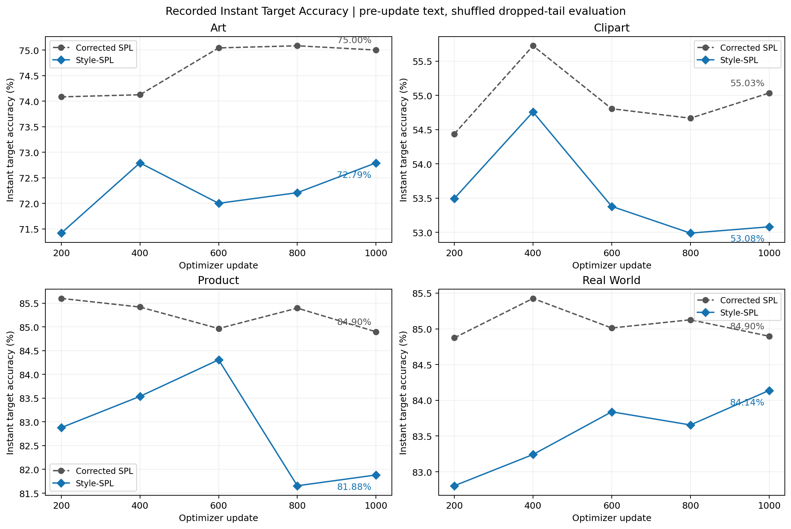
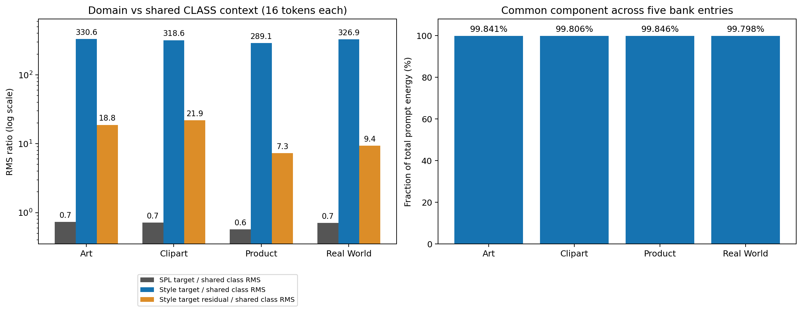
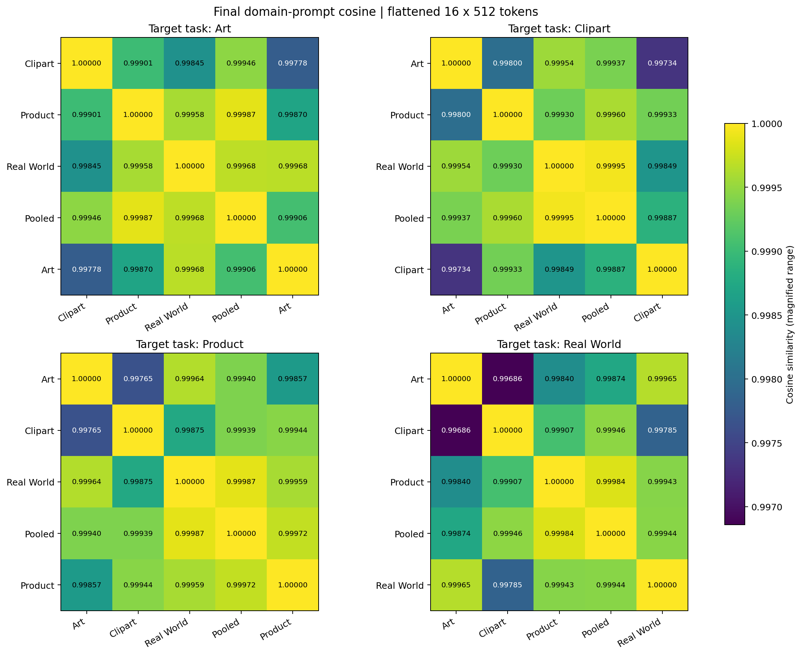
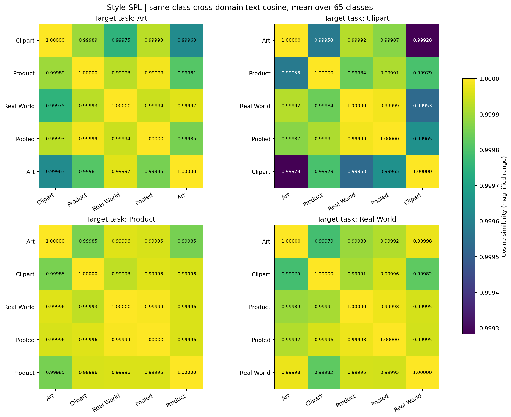
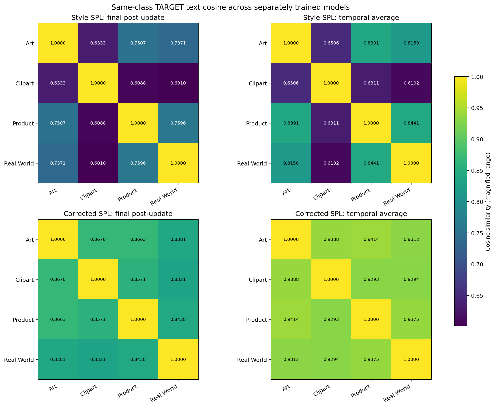
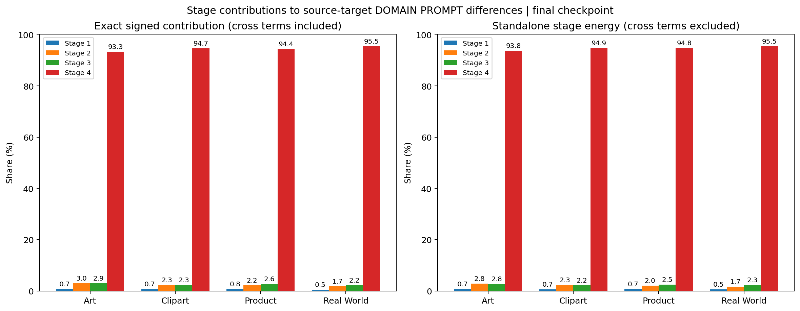
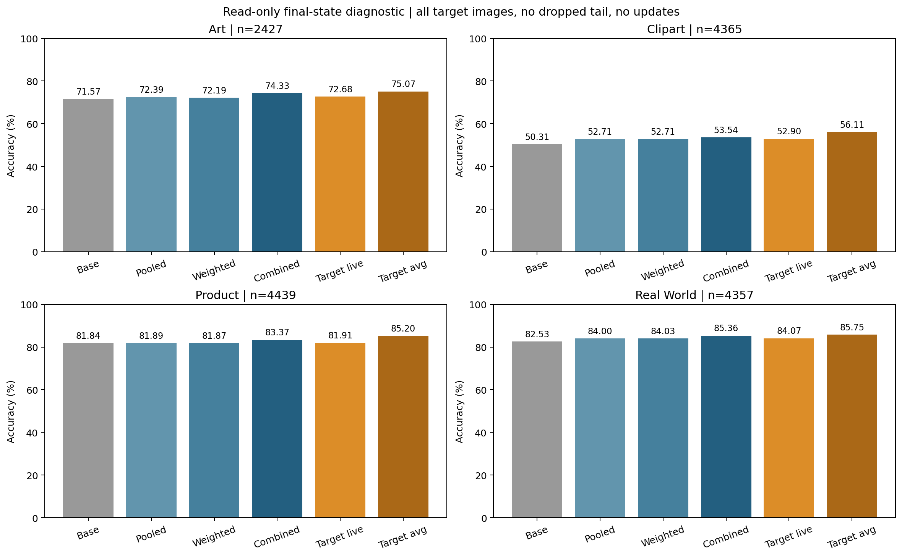

# Style-SPL：2026-10-09 首轮训练诊断

本报告只读取已完成的 seed=1、RN50、1000-step、OT-off 实验。没有新训练、消融、参数更新或标签调参。原检查点 SHA256 在分析前后完全一致。

## 核心判断

本轮出现的是**同一模型内部的域条件文本表示趋同**：源域、合并源域和目标域的同类别文本特征接近相同。它不是全类别语义塌缩，因为不同类别仍有明显差异。域提示的共同分量占绝大部分能量；改变 Source 路由几乎不改变教师预测。

四套目标模型之间仍有较大差异，但它们各自训练了类别提示和 Projector。这不能单独证明共享模型能识别域，也不能证明这些差异有益。

## 评测与指标口径

- Instant Accuracy 图直接来自训练日志，使用当步更新前的文本特征，以及原基线 shuffle=True / drop_last=True 的评测。
- 教师诊断使用最终更新后的参数和保存的源域质心，覆盖完整目标集合：Art 2427、Clipart 4365、Product 4439、Real World 4357；shuffle=False、drop_last=False。教师比较共享同一批图像和标签。
- 因此教师诊断分数与原正式最终准确率不是完全相同的评测口径。历史教师准确率没有记录，不能由最终检查点回推。
- 五组 Domain Prompt 是 3 个 Source、1 个 Pooled Source、1 个 Target。Pooled 不是第五个真实域。
- Domain Prompt Cosine 对对应位置的 16×512 token 展平计算；另存逐 token 对齐余弦及减去共同提示后的矩阵。
- Shared Prompt 指 65 类共享于各域的 `ctx_cls`；RMS 在其全部元素上计算。域均值共同分量另行统计，不能与 Shared Class Prompt 混称。
- 同类别跨域 Text Cosine 先对每个类别比较，再在 65 类上求均值，未将所有类别平均成一个原型；逐类别结果也已保存。
- 跨目标模型比较分别展示最终即时特征与时间平均特征。计算余弦时才做单位化；时间平均特征的分类评测不额外归一化。

## Instant Target Accuracy

| 目标域 | SPL 即时1000 | Style 即时1000 | SPL 正式最终 | Style 正式最终 |
| --- | --- | --- | --- | --- |
| Art | 75.00% | 72.79% | 76.38% | 75.21% |
| Clipart | 55.03% | 53.08% | 56.41% | 56.07% |
| Product | 84.90% | 81.88% | 86.51% | 85.17% |
| Real World | 84.90% | 84.14% | 86.21% | 85.75% |

Style-SPL 在五个已记录的评测时点均未超过基线。Clipart 在 step400 后下降，Product 在 step600→800 明显下降；Real World 总体缓慢改善，中间有小幅波动。时间平均特征提高了最终分数，但这种提高不等于最后一步模型已经恢复。只有五个评测时点，不能据此推断未记录的逐步变化。

## 域提示共同分量与 RMS

| 目标域 | Target / Class RMS | SPL Target / Class RMS | Target 残差 / Class RMS | 共同提示能量占比 |
| --- | --- | --- | --- | --- |
| Art | 330.6 | 0.730 | 18.78 | 99.841% |
| Clipart | 318.6 | 0.716 | 21.90 | 99.806% |
| Product | 289.1 | 0.573 | 7.26 | 99.846% |
| Real World | 326.9 | 0.705 | 9.36 | 99.798% |

五组提示均值构成共同分量，各提示减去该均值构成域残差。初始化时共同能量已约99.56%；训练后增至99.80–99.85%。残差/共同分量 RMS 从约6.6%降至约3.9–4.5%。所以‘各域提示不同’成立，但大部分提示能量并不用于域间差异。域残差本身仍大于类别提示，不能把它误称为绝对接近零。

[去共同分量后的矩阵](figures/domain_prompt_centered_cosine.png)与[SPL 原始提示矩阵](figures/baseline_domain_prompt_cosine.png)用于检查共同偏移对原始余弦的影响。矩阵采用放大的色标，数值均直接标注。

## 同一模型内的同类别文本差异

| 目标模型 | Style Source→Target 同类别余弦范围 | SPL 对应范围 | Style Target 不同类别平均余弦 |
| --- | --- | --- | --- |
| Art | 0.999627–0.999968 | 0.809199–0.925210 | 0.4788 |
| Clipart | 0.999283–0.999794 | 0.780489–0.901732 | 0.4748 |
| Product | 0.999853–0.999959 | 0.771739–0.902547 | 0.4490 |
| Real World | 0.999821–0.999980 | 0.722517–0.796263 | 0.4058 |

Style-SPL 的域间同类别方向几乎重合；SPL 仍保留明显的同类别跨域方向差异。Style 不同类别的余弦约0.41–0.48，说明类别语义并没有一同塌缩。因此更准确的表述是‘域条件的语义效果趋同’，而不是‘整个文本编码器失效’。

[SPL 同类别矩阵](figures/baseline_same_class_text_cosine.png)、`raw_analysis.json` 的类别分位数及 `per_class/` 的逐类 CSV 可检查均值是否掩盖少数异常类别。

## 不同目标任务的 Target Feature

四套 Style-SPL 模型最终即时 Target Feature 的同类别跨模型余弦为0.6010–0.7596，时间平均为0.6102–0.8441；SPL 对应为0.8321–0.8670与0.9293–0.9414。Style 的模型间差异确实更大，但与同模型内的0.999级域间相似度形成对照。

这提示当前结构可能主要学习了每个训练任务各自的整体提示，而没有在同一 Projector 内形成足够的域角色差异。它是与现有指标相符的解释，尚不是因果验证。Clipart 与另外三套目标模型的差异尤其大。

## 各 Stage 对 Domain Difference 的贡献

| 目标域 | Stage 1 | Stage 2 | Stage 3 | Stage 4 |
| --- | --- | --- | --- | --- |
| Art | 0.72% | 3.01% | 2.94% | 93.33% |
| Clipart | 0.72% | 2.31% | 2.27% | 94.69% |
| Product | 0.76% | 2.18% | 2.65% | 94.41% |
| Real World | 0.50% | 1.75% | 2.23% | 95.52% |

将源域与目标域 Stage Token 的差异乘以该 Stage 的 Expansion 列，得到四个贡献向量。四向量之和精确等于总 Domain Prompt 差异；归因保留交叉项及抵消，按差异能量聚合三个 Source→Target 配对。另图同时给出忽略交叉项的单 Stage 能量比例。

Stage 4 占93–96%，前三级合计只有4–7%。四个 Stage 梯度非零，并不意味着它们提供了相近的域差异。原始 Bank 的 Stage4 输入本身比前三级更有域间差异，所以贡献集中未必就是故障。这是原始提示空间的精确归因；Text Encoder 是非线性的，不能将这些百分比直接解释为最终文本特征的因果贡献。

## Base / Pooled / Weighted Source Teacher 准确率

| 目标域 | Base | Pooled | Weighted Source | Combined | Target即时 | Target平均 |
| --- | --- | --- | --- | --- | --- | --- |
| Art | 71.57% | 72.39% | 72.19% | 74.33% | 72.68% | 75.07% |
| Clipart | 50.31% | 52.71% | 52.71% | 53.54% | 52.90% | 56.11% |
| Product | 81.84% | 81.89% | 81.87% | 83.37% | 81.91% | 85.20% |
| Real World | 82.53% | 84.00% | 84.03% | 85.36% | 84.07% | 85.75% |
| 四域均值 | 71.56% | 72.75% | 72.70% | 74.15% | 72.89% | 75.53% |

Weighted Source 按原 SPL 的逐图像×逐类别负平方距离 softmax 加权源域余弦 logits；不重新归一化混合文本，不改为平均概率。Combined 对 Base、Pooled、Weighted 的 logits 做三项平均。

| 目标域 | Pooled 与 Weighted 预测不同 | 占目标图像比例 | 路由最大权重均值 | 相对Base：Combined纠错 / 破坏正确预测 |
| --- | --- | --- | --- | --- |
| Art | 10/2427 | 0.412% | 0.891 | 156 / 89 |
| Clipart | 34/4365 | 0.779% | 0.876 | 293 / 152 |
| Product | 2/4439 | 0.045% | 0.823 | 223 / 155 |
| Real World | 2/4357 | 0.046% | 0.841 | 244 / 121 |

路由最大权重均值0.82–0.89，说明路由计算并非均匀无效；但候选源域文本特征几乎相同，切换权重难以改变输出。Weighted 相对 Pooled 的准确率变化仅约−0.21至+0.02个百分点。Base 与训练后的类别表示仍有互补，Combined 相对 Base 提高约1.53–3.23个百分点。

官方 SPL 检查点只保存 Prompt，没有质心历史，因此其 Weighted/Combined 教师不能精确恢复。可恢复的 Pooled 教师同口径结果为：Art 71.90%，Clipart 53.84%，Product 81.59%，Real World 83.02%。不能用 Style 的质心补入 SPL 来冒充原教师。

## 当前可支持的机制线索与边界

1. 输入 Bank 不同且固定，Stage / Expansion 真实更新；当前问题不是分支没训练。
2. 共模提示能量随训练占比上升，同模型内域条件文本方向趋同。
3. 候选源域教师趋同后，距离路由虽然正常工作，却几乎失去提供额外预测差异的空间。
4. 因此最值得深入的问题是：为什么共享 Projector 更倾向生成每个任务的共同提示，而不是保留输入中的域差异。特别是原始 Stage4 描述子 Source→Target 余弦约0.90–0.98，输入中已有差异；生成提示与最终文本却更接近。大 RMS、输入统计的共同分量和 Stage4 主导是待检验的解释，不应直接宣布其中任意一项为唯一根因。
5. 本轮为单种子，不能据此宣布所有配置下都会发生该现象，也不能将差异越大简单等同于适配越有效。

所有图提供同名 PDF；`raw_analysis.json` 包含完整矩阵、均值/标准差/分位数、逐 Stage 配对能量及检查点 SHA256；`summary.json` 为紧凑摘要。没有启动新消融。

## 附：输入 Bank 的 Stage 描述子余弦

直接比较固定的拼接 mean/std 描述子，用于观察投影之前已经有多少共同分量。它不依赖目标真实类别标签。

| 目标域 | Stage1 Source→Target | Stage2 | Stage3 | Stage4 |
| --- | --- | --- | --- | --- |
| Art | 0.99584–0.99966 | 0.99383–0.99956 | 0.99852–0.99980 | 0.89980–0.97634 |
| Clipart | 0.99584–0.99918 | 0.99383–0.99881 | 0.99852–0.99931 | 0.89980–0.91513 |
| Product | 0.99734–0.99918 | 0.99549–0.99881 | 0.99911–0.99950 | 0.91063–0.95887 |
| Real World | 0.99752–0.99966 | 0.99605–0.99956 | 0.99876–0.99980 | 0.90386–0.97634 |
