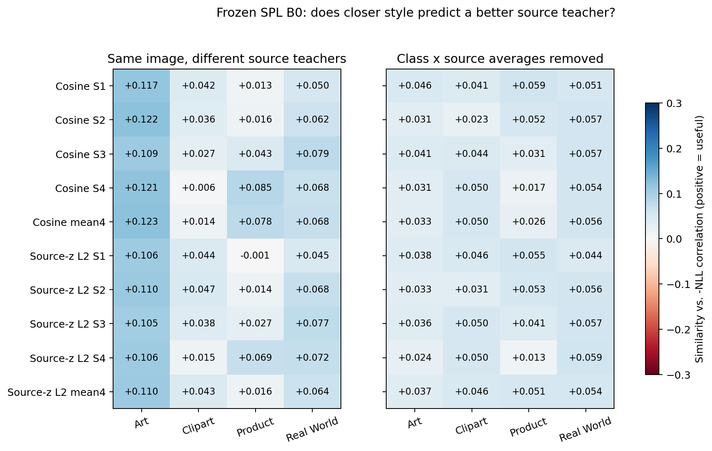
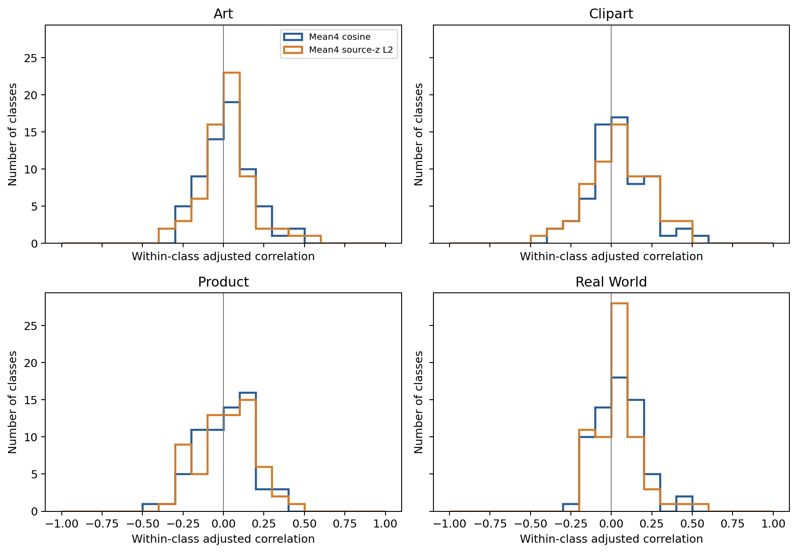
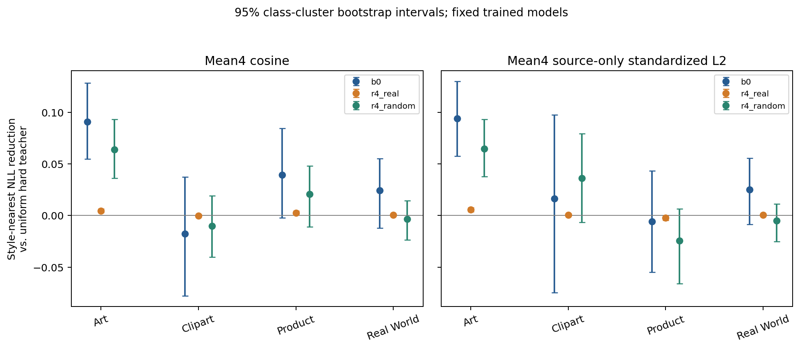
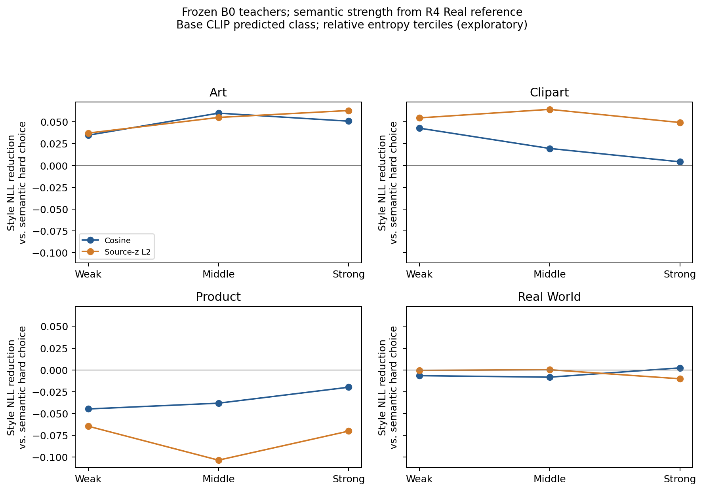

# 冻结 SPL B0：逐图像 Style Similarity 与 Source Teacher 可靠性

结论：**风格距离包含弱的逐图像 Teacher 可靠性信息，但当前距离不足以单独承担可靠的源 Teacher 路由。** B0 保留了充分的 Teacher 差异；控制类别×源 Teacher 平均优势后，两种四层平均距离的正向相关仍存在，但仅约 0.026–0.056。风格最近优于均匀随机选择的部分收益来自整体较强源域的偏好；四个任务都没有超过事后挑出的整体最强固定 Source Teacher。后者使用目标标签挑选，只是解释性参照，不能当作无标签部署基线。

## 范围与数据完整性

- OfficeHome 四个 leave-one-domain-out 任务，3 个有标签源域→1 个无标签目标域；完整目标池共 15,588 张图、每域 65 类。
- 主要对象为已完成的、协议修正后的官方 SPL B0 最后一步 Source Teachers；全部参数冻结。补充 R4 Real / Random，使用同一真实物理 Style Bank，不用随机或打乱的输入 codes 充当物理风格。
- 没有训练、更新 BN、修改网络结构或搜索路由温度。提取器没有读取目标类别标签；分析器只在离线 correctness/NLL、类别分层和统计控制中读取标签。
- 图像路径、preprocess、数据 manifest 全部核对；四域 image embeddings 与旧缓存逐元素一致（max error=0），逐图像统计的平均值与已有 Style Bank 四层逐元素一致（max error=0）。所有输入 Teacher 状态 SHA256 在分析后保持不变，见 provenance.json。
- 第一次提取因默认卷积后端与旧实验不同而未通过数值对齐检查，未生成正式缓存；改用原训练的 `fix_random_seed` 数值设置（cuDNN disabled）后重新提取并通过精确检查。失败日志保留于服务器，未用于指标。

## 两种距离与可靠性

每层把 RN50 空间 mean 和 per-image spatial std 拼接。**先计算逐 Stage cosine distance**；随后对拼接 descriptor 各坐标用该任务三个源域全部图像的 population std 标准化，计算坐标均方的平方根 L2。标准化均值、标准差与 floor=1e-6 均不使用目标数据或标签；源域样本数加权，银行是 per-image std 的平均。各 Stage 分别评估，四层距离等权平均只作为预先固定的聚合参照，没有根据目标标签选层。

NLL 用原始 CLIP RN50 `logit_scale.exp()=100.000000`、归一化 image/text features 和稳定 log-softmax 计算。正确率用每个源 Teacher 的完整 65 类预测。应期待 **distance–NLL 正相关、similarity–可靠性正相关**；以下统一报告 similarity=−distance 与可靠性=−NLL，正值为有用方向。

同一图像内比较 3 个 Teacher 可消除图像共有难度；进一步减去每个类别×源 Teacher 的平均值，检查是否只是在偏爱一个整体更强的源。类别控制只用于解释，不能成为依赖真实目标类别的推理策略。

## B0 是否保留可检测的 Teacher 差异

| 目标 | 源顺序 | 各源准确率 % | 各源 NLL | 三源预测一致率 | 平均单图 NLL range |
| --- | --- | --- | --- | --- | --- |
| Art | clipart, product, real_world | 68.85, 68.40, 72.68 | 1.147, 1.200, 1.007 | 70.79% | 0.755 |
| Clipart | art, product, real_world | 51.20, 51.32, 52.42 | 2.068, 1.955, 1.894 | 56.77% | 0.983 |
| Product | art, clipart, real_world | 80.22, 78.08, 82.79 | 0.698, 0.780, 0.596 | 78.78% | 0.574 |
| Real World | art, clipart, product | 83.11, 79.57, 83.54 | 0.610, 0.713, 0.571 | 81.36% | 0.539 |

B0 的三源一致率 56.77%–81.36%，而 R4 Real 为 98.06%–99.82%。因此本轮 B0 的弱关联不能简单归因于 Teacher 已趋同；B0 确有足够多的预测和 NLL 差异可供检测。这里是 Source Teacher 的最后一步性能，不是 B0 论文/正式实验的 Target Student temporal-average 准确率。

## 逐 Stage 关联：不是 Stage4 始终最有价值

### Cosine distance

下表是控制类别×源平均优势后的同图 Teacher 关联（正值为相似度更高、NLL 更低）。

| Stage/聚合 | Art | Clipart | Product | Real World |
| --- | --- | --- | --- | --- |
| stage1 | +0.0462 | +0.0408 | +0.0592 | +0.0510 |
| stage2 | +0.0315 | +0.0226 | +0.0515 | +0.0565 |
| stage3 | +0.0412 | +0.0441 | +0.0307 | +0.0567 |
| stage4 | +0.0309 | +0.0501 | +0.0175 | +0.0545 |
| mean4 | +0.0335 | +0.0503 | +0.0258 | +0.0561 |

### Source-only 标准化 L2 distance

下表是控制类别×源平均优势后的同图 Teacher 关联（正值为相似度更高、NLL 更低）。

| Stage/聚合 | Art | Clipart | Product | Real World |
| --- | --- | --- | --- | --- |
| stage1 | +0.0380 | +0.0462 | +0.0552 | +0.0445 |
| stage2 | +0.0334 | +0.0309 | +0.0527 | +0.0559 |
| stage3 | +0.0356 | +0.0500 | +0.0413 | +0.0565 |
| stage4 | +0.0235 | +0.0497 | +0.0129 | +0.0594 |
| mean4 | +0.0369 | +0.0458 | +0.0507 | +0.0539 |

各层都出现小幅正相关，没有一致的 Stage4 优势。例如 Product 的 cosine 调整后相关从 S1 的 0.059 降至 S4 的 0.017；不能把此前 Stage4 对 Prompt Difference 的贡献最大解释成它对 Teacher Reliability 最有用。空间统计也可能含类别信息，类别控制不能证明已经完全剥离语义。

## 选择最接近风格的 Teacher，会改善性能吗

均匀参照是等概率选择一个 Teacher 的期望，不是平均 logits；原语义路由的类条件 logit mixture 另列于 summary.json。固定最强 Teacher 通过目标标签事后挑选，仅用于拆解总体优势。下表用四层平均 cosine：

| 目标 | Style Accuracy % | 较均匀 Δpp | 较均匀 NLL 降低 | 最佳固定源 Accuracy % | 较最佳固定源 NLL 降低 | 一对正确/错误 Teacher 的风格排序胜率/支持数 |
| --- | --- | --- | --- | --- | --- | --- |
| Art | 72.15 | +2.17 | +0.0906 | 72.68 | -0.0201 | 60.54% / 882 |
| Clipart | 50.88 | -0.76 | -0.0175 | 52.42 | -0.0961 | 48.10% / 1890 |
| Product | 81.53 | +1.16 | +0.0393 | 82.79 | -0.0562 | 56.14% / 1450 |
| Real World | 82.95 | +0.87 | +0.0243 | 83.54 | -0.0361 | 58.41% / 1260 |

Art 的 cosine 路由较均匀 +2.17pp、NLL 降低 0.0906，但固定 Real World Teacher 已更强；Clipart 的正确/错误 Teacher 风格排序接近随机且略低于 50%。不能把 Art 的收益解释为通用、强烈的逐图像风格路由能力。**硬选择一个 Teacher 的结果不是软加权或类条件 logits 融合的性能上界；本轮没有测试新的 soft mixture 或其训练效果。**

进一步去除类别×源平均 NLL 后，逐图像选择仍有小幅收益：

| 距离 | 目标 | 调整后 r | 调整后 NLL 降低 | 95% 类别 cluster CI | 正相关类别数 |
| --- | --- | --- | --- | --- | --- |
| cosine_mean4 | Art | +0.0335 | +0.0081 | [-0.0022, +0.0206] | 37/65 |
| cosine_mean4 | Clipart | +0.0503 | +0.0175 | [+0.0011, +0.0352] | 38/65 |
| cosine_mean4 | Product | +0.0258 | +0.0086 | [-0.0055, +0.0228] | 36/65 |
| cosine_mean4 | Real World | +0.0561 | +0.0120 | [-0.0043, +0.0305] | 40/65 |
| source_z_l2_mean4 | Art | +0.0369 | +0.0079 | [-0.0046, +0.0211] | 38/65 |
| source_z_l2_mean4 | Clipart | +0.0458 | +0.0230 | [+0.0113, +0.0347] | 40/65 |
| source_z_l2_mean4 | Product | +0.0507 | +0.0207 | [+0.0012, +0.0406] | 37/65 |
| source_z_l2_mean4 | Real World | +0.0539 | +0.0201 | [+0.0031, +0.0385] | 44/65 |

标准化 L2 的校正后 NLL 收益在 Clipart / Product / Real World 的类 cluster 区间为正，提供了一些**有信息但较弱**的证据；cosine 的区间多数跨零。65 类中仅 36–44 类正相关，不是所有类别都遵循同一规律。固定模型的类别 bootstrap 只描述本轮数据构成的不确定性，不能代替多训练种子检验；十种距离/层分析涉及多重探索，不应凭小 p 值宣称方法有效。

单个 Teacher 上跨图像的 correctness AUC 与同图源排序是不同问题。Product/Real World 的部分 cosine 按类别 AUC 低于 0.5，即“风格较近的图更容易分类”不普遍成立；详见 per_teacher.csv。

## 与现有语义路由是否互补

B0 原检查点没有保存 source class centroids，不能重构其训练结束时的原始语义权重。B0 使用 R4 Real 已保存的路由作为共同参考；R4 两组使用各自真实保存的路由。可执行的类索引用冻结 Base CLIP 的预测，不用真实目标类别；真实类别切片仅以 `offline_only` 保存。

语义强弱按该预测类别的路由 entropy 排为三等份（低 entropy 为强），阈值不看标签；还保存固定 max-weight<0.6 / ≥0.9 的绝对分层，防止把相对弱误叫成绝对低置信。按类别×语义强弱的交叉指标见 class_semantic_strata.csv。

| 目标 | 语义弱：Style NLL 降低 | 中 | 强 |
| --- | --- | --- | --- |
| Art | +0.0347 | +0.0600 | +0.0508 |
| Clipart | +0.0428 | +0.0195 | +0.0042 |
| Product | -0.0448 | -0.0381 | -0.0198 |
| Real World | -0.0066 | -0.0083 | +0.0023 |

风格相对语义选择在 Art 更有利、Clipart 弱路由区域有一些互补，但 Product 三层都受损；Real World 接近零。**没有支持统一的“语义弱就用 Style”规则。** 这是固定 B0 Teacher+R4 语义参考的离线比较，不能转述为原 B0 推理改进。

## 对下一步研究的判断

1. Teacher 趋同确实降低可检测的路由收益，B0 是更合适的诊断起点；但恢复 Teacher 差异后，真实 Style Distance 仍只给出弱、不稳定的可靠性信号。
2. 风格匹配与 Teacher 本身的类别能力是两个不同因素：近风格源不一定是最强源。均匀选择对照会混入固定源的总体优势，这是下一步机制叙事必须分清的问题。
3. 尚不足以直接将 `softmax(-τ_s distance)` 全量替换/叠加到 SPL，再把性能波动当作 Style 路由的证据。若继续探索，更适合将风格作为受限的辅助信号，并明确验证何种源/类别/语义冲突场景存在增量信息；本轮没有启动这样的训练。
4. Source-only 标准化 L2 较 raw cosine 更能保留一些类别控制后的信号，值得保留为候选，但它尚未在所有域的实际源选择准确率/NLL上稳定获益；不能据此宣称距离选择或方法已经定型。

## 文件与复现

- summary.json：12 组任务×10 个预先固定距离指标；包含源顺序、Source Teacher 正确率/NLL、分层、路由协议、NLL scale 与提取完整性。
- per_class.csv / per_teacher.csv：逐类别关联、类别内 AUC 和 Teacher 个体难度关联。
- semantic_strata.csv / absolute_strata.csv / class_semantic_strata.csv：相对、绝对及交叉分层。
- figures/：PNG 与 PDF 科学图。
- provenance.json：代码和输入状态 SHA、零训练更新、任务退出状态。
- 服务器 `~/workspace/Style-SPL/runs/style_reliability_20261010/styles` 保存四域逐图像统计与 B0 texts；`analysis_complete/per_image_*.pt` 保存路径、离线标签、每源 NLL/正确性、10 种距离和语义权重。大张量没有提交 git。

运行：先 `scripts/extract_image_styles.py`，再 `scripts/analyze_style_reliability.py`，最后 `scripts/plot_style_reliability.py` 和本脚本。统计检查 tests/test_style_reliability.py 验证 source-only 标准化不读取 target 样本、固定源优势被移除、逐图像有效信号仍能保留。
